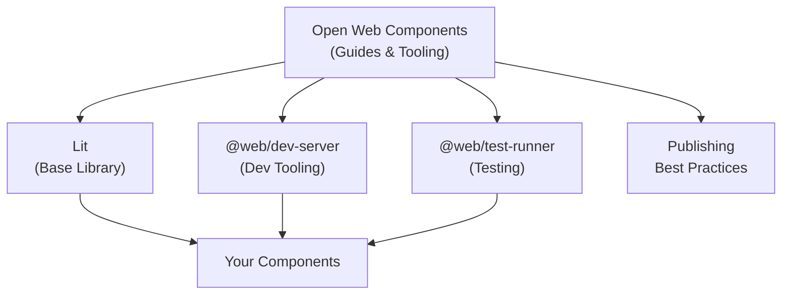

# Investigation: Open Web Components & Lit

## Table of Contents

1. [What Are They?](#what-are-they)
2. [How They Relate](#how-they-relate)
3. [Getting Started](#getting-started)
4. [Lit Component Anatomy](#lit-component-anatomy)
5. [Lifecycle](#lifecycle)
6. [Reactive Properties & State](#reactive-properties--state)
7. [Templates & Expressions](#templates--expressions)
8. [Styles & Shadow DOM](#styles--shadow-dom)
9. [Slots (Content Projection)](#slots-content-projection)
10. [Events](#events)
11. [Reactive Controllers](#reactive-controllers)
12. [Context API](#context-api)
13. [Testing](#testing)
14. [Going Buildless](#going-buildless)
15. [Publishing Best Practices](#publishing-best-practices)
16. [Community Component Libraries](#community-component-libraries)

---

## What Are They?

### Open Web Components (open-wc.org)

**Open Web Components** is a community project that provides **guides, tools, and recommendations** for developing web components. It is NOT a component library itself — it's a **standards body / opinion guide** that tells you _how_ to properly build, test, and publish web components.

Key offerings:
- **Project generator** (`npm init @open-wc`)
- **Best-practice guides** for development, testing, publishing
- **Tool recommendations** (dev server, test runner, linting)
- **Knowledge base** on lifecycle, events, styling, attributes
- Sister project: [Modern Web](https://modern-web.dev/) (shared tooling)

### Lit (lit.dev)

**Lit** is a lightweight library (~5KB) for building **fast, standards-compliant web components**. It provides:
- `LitElement` — base class for components
- `lit-html` — efficient HTML templating via tagged template literals
- Reactive properties, scoped styles, and a declarative template system
- TypeScript decorators for ergonomic development
- Reactive controllers & Context API for advanced composition

> [!IMPORTANT]
> **Open-wc recommends Lit as the default base library** for web component projects. Their generator scaffolds Lit-based components out of the box.

---

## How They Relate



**Open-wc** = the _opinions and tooling_. **Lit** = the _code you write_. They complement each other.

---

## Getting Started

### Scaffold a New Project

```bash
npm init @open-wc
```

This interactive generator prompts you to choose:
- **Project type**: Web component, Application, etc.
- **Features**: Testing, Linting, Demo, etc.
- **Base library**: Lit (recommended default)

The generator sets up a complete project with:
- Lit component boilerplate
- `@web/dev-server` for development
- `@web/test-runner` for testing
- ESLint + Prettier configs
- Demo pages

---

## Lit Component Anatomy

### Minimal Component (with Decorators — TypeScript)

```typescript
import {LitElement, html, css} from 'lit';
import {customElement, property} from 'lit/decorators.js';

@customElement('my-greeting')
export class MyGreeting extends LitElement {
  static styles = css`
    :host {
      display: block;
      padding: 16px;
      border: 1px solid #ccc;
    }
    h1 { color: blue; }
  `;

  @property({type: String})
  name = 'World';

  @property({type: Number})
  count = 0;

  render() {
    return html`
      <h1>Hello, ${this.name}!</h1>
      <p>Click count: ${this.count}</p>
      <button @click=${this._increment}>Click me</button>
    `;
  }

  private _increment() {
    this.count++;
  }
}

// TypeScript: register in HTMLElementTagNameMap for type safety
declare global {
  interface HTMLElementTagNameMap {
    'my-greeting': MyGreeting;
  }
}
```

### Minimal Component (without Decorators — plain JS)

```javascript
import {LitElement, html, css} from 'lit';

export class MyGreeting extends LitElement {
  static properties = {
    name: {type: String},
    count: {type: Number},
  };

  static styles = css`
    :host { display: block; padding: 16px; }
  `;

  constructor() {
    super();
    this.name = 'World';
    this.count = 0;
  }

  render() {
    return html`
      <h1>Hello, ${this.name}!</h1>
      <p>Click count: ${this.count}</p>
      <button @click=${this._increment}>Click me</button>
    `;
  }

  _increment() {
    this.count++;
  }
}

customElements.define('my-greeting', MyGreeting);
```

> [!TIP]
> The decorator syntax (`@customElement`, `@property`) requires TypeScript with `experimentalDecorators`. The `static properties` approach works in plain JavaScript.

---

## Lifecycle

### Sequence

**First render:**
```
constructor → connectedCallback → update → render → updated → firstUpdated
```

**Subsequent renders:**
```
update → render → updated
```

### Key Callbacks

| Callback | When | Use For |
|---|---|---|
| `constructor()` | Element instantiated | One-time sync setup, default values, self-listeners |
| `connectedCallback()` | Added to DOM | DOM-dependent setup, external listeners (`window`) |
| `disconnectedCallback()` | Removed from DOM | Cleanup external listeners |
| `willUpdate(changed)` | Before each render | Derive values from changed properties |
| `update(changed)` | Before render (with DOM access) | Modify properties before render |
| `render()` | Each render cycle | Return `html` template |
| `updated(changed)` | After each render | React to property changes, DOM measurements |
| `firstUpdated(changed)` | After first render only | One-time DOM setup (e.g., focus, 3rd party libs) |
| `shouldUpdate(changed)` | Before update | Return `false` to skip render |

> [!WARNING]
> **Always call `super.connectedCallback()`** in `connectedCallback()`. LitElement does important work there. This is easy to miss!

> [!WARNING]
> **No side effects in constructor**. Someone may create your element without appending it to the DOM. Only register self-listeners in constructor.

---

## Reactive Properties & State

### `@property()` — Public API (reflected to attributes)

```typescript
@property({type: String}) name = 'World';
@property({type: Number}) count = 0;
@property({type: Boolean}) disabled = false;
@property({type: Array}) items: string[] = [];
@property({type: Object}) config = {};
```

### `@state()` — Internal (not reflected, not part of public API)

```typescript
@state() private _selectedIndex = -1;
@state() private _isLoading = false;
```

Any change to a `@property` or `@state` field triggers a re-render.

### Property Options

```typescript
@property({
  type: String,       // Converter for attribute ↔ property
  attribute: 'my-name', // Custom attribute name (or false to disable)
  reflect: true,      // Sync property back to attribute
  hasChanged: (newVal, oldVal) => newVal !== oldVal, // Custom change detection
})
```

---

## Templates & Expressions

Lit uses tagged template literals (`html``) with special binding syntax:

```typescript
render() {
  return html`
    <!-- Text content -->
    <h1>Selected: ${this.selectedIndex >= 0 ? this.items[this.selectedIndex] : 'None'}</h1>

    <!-- Attribute binding (string) -->
    <div class="container ${this.disabled ? 'disabled' : 'enabled'}">

    <!-- Boolean attribute (? prefix) — adds/removes attribute -->
    <button ?disabled=${this.disabled}>Submit</button>

    <!-- Property binding (. prefix) — sets JS property, not attribute -->
    <input type="text" .value=${this.label}>

    <!-- Event listener (@ prefix) -->
    <button @click=${this._handleClick}>Click</button>

    <!-- Conditional rendering -->
    ${this.disabled
      ? html`<p class="warning">Form is disabled</p>`
      : html`<p class="info">Form is active</p>`
    }

    <!-- Rendering nothing (removes from DOM entirely) -->
    ${this.selectedIndex < 0 ? nothing : html`<span>Index: ${this.selectedIndex}</span>`}

    <!-- Rendering lists -->
    <ul>
      ${this.items.map((item, i) => html`
        <li class=${i === this.selectedIndex ? 'selected' : ''}
            @click=${() => this._selectItem(i)}>
          ${item}
        </li>
      `)}
    </ul>

    <!-- Nested template composition -->
    ${this._renderFooter()}
  `;
}

private _renderFooter() {
  return html`<footer>Total items: ${this.items.length}</footer>`;
}
```

### Binding Cheatsheet

| Syntax | Type | Example |
|---|---|---|
| `${expr}` | Text content | `<p>${this.name}</p>` |
| `attr=${expr}` | Attribute (string) | `class=${this.cls}` |
| `?attr=${expr}` | Boolean attribute | `?disabled=${this.off}` |
| `.prop=${expr}` | Property | `.value=${this.val}` |
| `@event=${handler}` | Event listener | `@click=${this.fn}` |

---

## Styles & Shadow DOM

Lit components use **Shadow DOM** by default for style encapsulation.

```typescript
static styles = css`
  /* :host targets the component element itself */
  :host {
    display: block;
    padding: 16px;
    --primary-color: blue;  /* CSS custom properties for theming */
  }

  /* :host with selector — conditional host styling */
  :host([disabled]) {
    opacity: 0.5;
    pointer-events: none;
  }

  /* Internal styles are scoped — won't leak out */
  h1 { color: var(--primary-color); }

  /* Style slotted content from Light DOM */
  ::slotted(h2) {
    margin: 0;
    color: #333;
  }

  ::slotted([slot="actions"]) {
    display: flex;
    gap: 8px;
  }
`;
```

### Multiple Style Sheets

```typescript
static styles = [
  sharedStyles,  // Import from another file
  css`
    :host { display: block; }
  `
];
```

### Theming via CSS Custom Properties

CSS custom properties **pierce the Shadow DOM boundary**, making them the recommended theming mechanism:

```css
/* Consumer page: */
my-card {
  --card-bg: #f5f5f5;
  --card-radius: 12px;
}
```

```typescript
/* Inside the component: */
static styles = css`
  :host {
    background: var(--card-bg, white);
    border-radius: var(--card-radius, 8px);
  }
`;
```

---

## Slots (Content Projection)

Slots let consumers inject Light DOM content into your component's Shadow DOM.

```typescript
@customElement('card-component')
export class CardComponent extends LitElement {
  static styles = css`
    .header { background: #f5f5f5; padding: 16px; }
    .content { padding: 16px; }
    .footer { background: #fafafa; padding: 12px 16px; }
  `;

  @property({type: String}) headerTitle = '';

  render() {
    return html`
      <div class="header">
        <!-- Named slot with fallback -->
        <slot name="header">
          <h2>${this.headerTitle || 'Card Title'}</h2>
        </slot>
      </div>
      <div class="content">
        <!-- Default slot -->
        <slot></slot>
      </div>
      <div class="footer">
        <slot name="actions">
          <button>Default Action</button>
        </slot>
      </div>
    `;
  }
}
```

**Usage:**
```html
<card-component>
  <h2 slot="header">Custom Header</h2>
  <p>Main content goes in default slot.</p>
  <div slot="actions">
    <button>Save</button>
    <button>Cancel</button>
  </div>
</card-component>
```

### Observing Slot Changes

```typescript
render() {
  return html`<slot @slotchange=${this._onSlotChange}></slot>`;
}

private _onSlotChange(e: Event) {
  const slot = e.target as HTMLSlotElement;
  const assignedElements = slot.assignedElements();
  console.log('Slotted elements:', assignedElements);
}
```

---

## Events

### TLDR (Open-wc Best Practices)

**Listening:**
| Where | How | Cleanup |
|---|---|---|
| On child DOM elements | `@event` in template | Automatic (lit-html manages) |
| On your own element | `addEventListener` in `constructor` | Automatic (garbage collected) |
| On external elements (`window`, `document`) | `addEventListener` in `connectedCallback` | **Manual** in `disconnectedCallback` |

**Dispatching:**
- Prefer `new Event('something-happened')` — no `bubbles`, no `composed`
- Use `CustomEvent` when you need to pass data
- Use `bubbles: true` **only** if a parent node needs it
- **Avoid** `composed: true` — leads to event pollution across shadow boundaries

### Example: Full Event Pattern

```typescript
@customElement('my-widget')
export class MyWidget extends LitElement {
  constructor() {
    super();
    // Listen on self — auto garbage collected
    this.addEventListener('done', this._handleDone);
    // Bind for external listeners
    this._handleResize = this._handleResize.bind(this);
  }

  connectedCallback() {
    super.connectedCallback();
    // External listener — must clean up
    window.addEventListener('resize', this._handleResize);
  }

  disconnectedCallback() {
    window.removeEventListener('resize', this._handleResize);
    super.disconnectedCallback();
  }

  render() {
    return html`
      <!-- Template listener — auto managed by lit-html -->
      <button @click=${this._handleClick}>Do thing</button>
    `;
  }

  private _handleClick() {
    // Dispatch simple event
    this.dispatchEvent(new Event('something-happened'));
    // Dispatch with data
    this.dispatchEvent(new CustomEvent('item-selected', {
      detail: { id: 42, name: 'Item' },
      bubbles: true,  // only if parent needs it
    }));
  }

  private _handleDone(e: Event) { /* ... */ }
  private _handleResize(e: Event) { /* ... */ }
}
```

---

## Reactive Controllers

Controllers encapsulate **reusable logic** that can plug into any Lit component. They participate in the component lifecycle without inheritance.

```typescript
// my-controller.ts
import {ReactiveController, ReactiveControllerHost} from 'lit';

export class ClockController implements ReactiveController {
  host: ReactiveControllerHost;
  value = new Date();
  private _timer?: ReturnType<typeof setInterval>;

  constructor(host: ReactiveControllerHost) {
    (this.host = host).addController(this);
  }

  hostConnected() {
    this._timer = setInterval(() => {
      this.value = new Date();
      this.host.requestUpdate();
    }, 1000);
  }

  hostDisconnected() {
    clearInterval(this._timer);
  }
}
```

```typescript
// my-clock.ts
import {LitElement, html} from 'lit';
import {customElement} from 'lit/decorators.js';
import {ClockController} from './my-controller.js';

@customElement('my-clock')
export class MyClock extends LitElement {
  private clock = new ClockController(this);

  render() {
    return html`<p>Time: ${this.clock.value.toLocaleTimeString()}</p>`;
  }
}
```

> [!TIP]
> Controllers are the **composition pattern** in Lit (vs. mixins or inheritance). Prefer controllers for cross-cutting concerns: timers, intersection observers, media queries, fetch logic, etc.

---

## Context API

Lit's `@lit/context` provides dependency-injection-style data sharing down the tree without prop drilling.

```typescript
// my-context.ts
import {createContext} from '@lit/context';

export interface UserData { name: string; role: string; }
export const userContext = createContext<UserData>('user-context');
```

```typescript
// provider.ts
import {LitElement, html} from 'lit';
import {ContextProvider} from '@lit/context';
import {userContext} from './my-context.js';

export class MyApp extends LitElement {
  private _provider = new ContextProvider(this, {
    context: userContext,
    initialValue: {name: 'Alice', role: 'admin'},
  });

  updateUser(data) {
    this._provider.setValue(data);
  }
}
```

```typescript
// consumer.ts — any descendant in the DOM tree
import {LitElement, html} from 'lit';
import {consume} from '@lit/context';
import {userContext, UserData} from './my-context.js';

export class UserBadge extends LitElement {
  @consume({context: userContext, subscribe: true})
  user?: UserData;

  render() {
    return html`<span>${this.user?.name} (${this.user?.role})</span>`;
  }
}
```

---

## Testing

### Recommended: `@web/test-runner`

Open-wc recommends [@web/test-runner](https://modern-web.dev/docs/test-runner/overview/) — runs tests in a **real browser**, uses native ES modules, no bundling.

```bash
# Run tests
npm run test

# Watch mode
npm run test:watch
```

### Example Test

```javascript
import {fixture, html, expect} from '@open-wc/testing';
import '../src/my-greeting.js';

describe('MyGreeting', () => {
  it('renders with default name', async () => {
    const el = await fixture(html`<my-greeting></my-greeting>`);
    expect(el.shadowRoot.querySelector('h1').textContent).to.equal('Hello, World!');
  });

  it('renders with custom name', async () => {
    const el = await fixture(html`<my-greeting name="Lit"></my-greeting>`);
    expect(el.shadowRoot.querySelector('h1').textContent).to.equal('Hello, Lit!');
  });

  it('increments count on button click', async () => {
    const el = await fixture(html`<my-greeting></my-greeting>`);
    el.shadowRoot.querySelector('button').click();
    await el.updateComplete;
    expect(el.count).to.equal(1);
  });
});
```

> [!NOTE]
> `@open-wc/testing` re-exports `fixture`, `expect` (chai), and `html` for convenient test setup. `fixture()` renders the element and waits for the first render to complete.

---

## Going Buildless

Open-wc advocates **buildless development** — leverage the browser's native ES module loader.

### Dev Server: `@web/dev-server`

```bash
npm start  # Starts dev server, opens demo/index.html
```

Features:
- **Watch mode** — auto-reload on file changes
- **`--node-resolve`** — resolves bare module specifiers (`import 'lit'` → actual file path)
- **Plugin API** for light transformations
- No bundling required during development

### Bare Module Imports

```javascript
// This "bare import" won't work in browsers natively:
import {LitElement} from 'lit';

// @web/dev-server resolves it to the actual path:
// → /node_modules/lit/index.js
```

In the future, [Import Maps](https://github.com/WICG/import-maps) will handle this natively.

---

## Publishing Best Practices

### ✅ Do

| Rule | Why |
|---|---|
| **Publish latest standard ECMAScript** | Let consumers handle transpilation for their targets |
| **Publish standard ES modules** | Stage 4, supported everywhere |
| **Include `"main"` and `"module"` in package.json** | Both pointing to the same ES module entry |
| **Export element classes** | Enables extension and scoped registries |
| **Export side effects separately** | `customElements.define()` is a side effect — keep it in a separate file |
| **Use bare import specifiers** for 3rd party | `import {LitElement} from 'lit'` |
| **Include file extensions** in imports | `import {ifDefined} from 'lit/directives/if-defined.js'` |

### ❌ Don't

| Rule | Why |
|---|---|
| **Don't bundle** | Bundling is an application-level concern |
| **Don't minify** | Minification is an application-level concern |
| **Don't optimize** | Only consumers know their delivery targets |
| **Don't use `.mjs` extensions** | MIME type issues on many servers |
| **Don't import polyfills** | Let consumers decide what to polyfill |

### File Structure (open-wc convention)

```
my-component/
├── src/
│   └── MyComponent.js     # Class export (no side effects)
├── my-component.js         # Side-effect file (calls customElements.define)
├── index.js                # Re-exports from src/
├── package.json
│   ├── "main": "index.js"
│   ├── "module": "index.js"
│   └── "type": "module"    # optional
├── demo/
│   └── index.html
└── test/
    └── my-component.test.js
```

> [!IMPORTANT]
> **Separating the class export from the `customElements.define()` call** is critical. It enables consumers to use scoped custom element registries and prevents duplicate registration errors.

---

## Community Component Libraries

Notable web component libraries built on open standards (curated by open-wc):

| Library | By | Notes |
|---|---|---|
| [Shoelace](https://shoelace.style/) | Community | Framework-agnostic, accessibility-first |
| [Material Web (MWC)](https://github.com/material-components/material-web) | Google | Official Material Design 3 components |
| [Lion](https://github.com/nicedoc/lion) | Community | White-label, highly extensible |
| [Spectrum Web Components](https://opensource.adobe.com/spectrum-web-components/) | Adobe | Adobe's design system |
| [Carbon Web Components](https://github.com/carbon-design-system/carbon-web-components) | IBM | IBM's Carbon design system |
| [FAST](https://fast.design) | Microsoft | Lightweight, standards-compliant |
| [Vaadin](https://vaadin.com/components) | Vaadin | Enterprise-grade, mobile-first |
| [Ionic](https://ionicframework.com/docs/components) | Ionic | Cross-framework mobile components |
| [UI5 Web Components](https://sap.github.io/ui5-webcomponents/) | SAP | Enterprise Fiori UX |
| [Patternfly Elements](https://patternflyelements.org/) | Red Hat | Based on PatternFly design |
| [mdui](https://www.mdui.org/) | Community | Material Design 3 (Material You) |

---

## Key Sources

- [open-wc.org](https://open-wc.org/) — Guides, tooling, best practices
- [lit.dev](https://lit.dev/) — Official Lit documentation
- [modern-web.dev](https://modern-web.dev/) — Dev server & test runner docs
- [Lit GitHub](https://github.com/lit/lit) — Source code & issues
